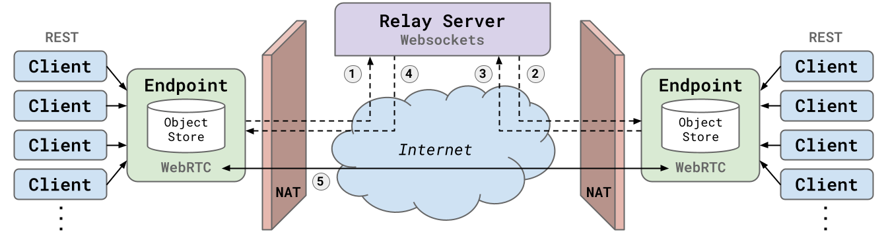
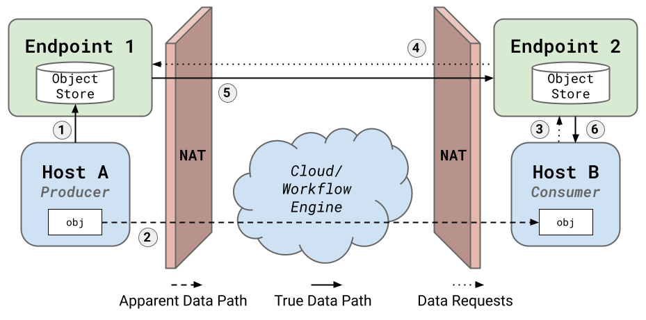

# Peer-to-Peer Endpoints

ProxyStore Endpoints are in-memory object stores
with peering capabilities. Endpoints enable data transfer with proxies
between multiple sites using NAT traversal.

!!! warning
    Endpoints are experimental and the interfaces and underlying
    implementations will likely change. Refer to the API docs for the most
    up-to-date information.

!!! warning
    Endpoints do not have user authentication yet, so use at your own risk.

## Overview

At its core, the [`Endpoint`][proxystore.endpoint.endpoint.Endpoint] is
an in-memory data store built on asyncio. Endpoints provide a REST
API, served using [`Quart`](https://pgjones.gitlab.io/quart/), and ProxyStore
provides the [`EndpointStore`][proxystore.store.endpoint.EndpointStore] as
the primary interface for clients to interact with endpoints.

<figure markdown>
  { width="100%" }
  <figcaption>
  <b>Figure 1:</b> ProxyStore Endpoints overview. Clients can make requests to
  any endpoint and those request will be forwarded to the correct endpoint.
  Endpoints establish peer-to-peer connections using UDP hole-punching and a
  publicly accessible signaling server.
  </figcaption>
</figure>

Unlike popular in-memory data stores (Redis, Memcached, etc.), ProxyStore
endpoints can operate as peers even from behind different NATs without the need
to open ports or SSH tunnels. To achieve direct data transfer between peers,
endpoints use the [WebRTC](https://webrtc.org/) standard to determine
how the peers can connect.

As shown in **Fig. 1**, endpoints use a commonly accessible *signaling server*
to facilitate peer connections. When an endpoint is started, the Endpoint
registers with the signaling server. Then, when an endpoint needs to make a
request from a peer, (1) the endpoint creates an *offer* and asks the
signaling server to forward the offer to the peer endpoint. The signaling
server forwards the offer (2) and the peer endpoint creates an *answer* to the
received offer. The peer endpoint returns the *answer* to the original
endpoint via the signaling server (3, 4).

The offer and answer contain information about the local and remote sessions
of the endpoints which can be used to complete the peer-to-peer connection (5).
(*Note*: this is a great simplification and more details can be found at
https://webrtc.org/getting-started/peer-connections.) The peers will then
keep a data channel open between themselves for the remainder of their
lifetime.

Clients interacting with an endpoint via the REST API and typical object store
operations (*get*, *set*, etc.) specify a *key* and an *endpoint UUID*.
Endpoints that receive a request with a different endpoint UUID will attempt
a peer connection to the endpoint if one does not exist already and forward
the request along and facilitate returning the response back to the client.

## Endpoint CLI

Endpoints can be configure and started with the `proxystore-endpoint`
command.

```bash
$ proxystore-endpoint configure my-endpoint --port 9732 --server remote-server.com:3574
Configured endpoint my-endpoint <12b8f3b6-6c0e-4141-b851-870895e3eb3c>.

To start the endpoint:
   $ proxystore-endpoint start my-endpoint
```

Endpoint configurations are stored to `$PROXYSTORE_HOME/{endpoint-name}`
or `$XDG_DATA_HOME/proxystore/{endpoint-name}`
(see [`home_dir()`][proxystore.utils.home_dir]) and contain the name, UUID,
host address, port, and singaling server address.

1. **Name:** readable name of the endpoint. Used for management in the CLI and
   to improve log readability.
2. **UUID:** primary identifier of the endpoint. The signaling server will
   use this UUID to keep track of endpoints.
3. **Host address:** host address of the Quart app for the endpoint.
   Defaults to the IP address of host the endpoint is configured on.
   Note: this address is only used by clients within the local network and
   can be set to *localhost* if the client and endpoints are on the same
   host.
4. **Port:** port the Quart app for the endpoint will listening on. Defaults to
   9753.
5. **Signaling server address**: address of signaling server to use for peer
   connections. All endpoints that may peer with each other must use the same
   signaling server. Signaling servers are optional, and if unspecified, the
   endpoint will operate without peering functionalities.

Starting the endpoint will load the configuration from the ProxyStore home
directory, initialize the endpoint, and start a Quart app using the host and
port.

```bash
$ proxystore-endpoint start my-endpoint
```

## EndpointStore

The primary interface to endpoints is the [`EndpointStore`][proxystore.store.endpoint.EndpointStore].

!!! note
    This section assumes familiarity with proxies and the
    [`Store`][proxystore.store.base.Store] interface. See the
    [Get Started](../getstarted.md) guide before getting started with endpoints.

```python
from proxystore.store.endpoint import EndpointStore

store = EndpointStore(
   name='default',
   endpoints=[
       '5349ffce-edeb-4a8b-94a6-ab16ade1c1a1',
       'd62910f6-0d29-452e-80b7-e0cd601949db',
       ...
   ],
)

p = store.proxy(my_object)
```

The [`EndpointStore`][proxystore.store.endpoint.EndpointStore] takes
a list of endpoint UUIDs. This list represents any endpoint that proxies
created by this store may interact with to resolve themselves. The
[`EndpointStore`][proxystore.store.endpoint.EndpointStore] will use this
list to find its *home* endpoint, the endpoint that will be used to issue
operations to. To find the *home* endpoint, the ProxyStore home directory
will be scanned for any endpoint configurations matching
the one of the UUIDs. If a match is found, the
[`EndpointStore`][proxystore.store.endpoint.EndpointStore] will attempt
to connect to the endpoint using the host and port in the configuration. This
process is repeated until a reachable endpoint is found. While the user could
specify the home endpoint directly, the home endpoint may change when a proxy
travels to a different machine.

## Proxy Lifecycle

<figure markdown>
  { width="100%" }
  <figcaption>
  <b>Figure 2:</b> Flow of data when transferring objects via proxies and
  endpoints.
  </figcaption>
</figure>

In distributed systems, proxies created from an
[`EndpointStore`][proxystore.store.endpoint.EndpointStore] can be used
to facilitate simple and fast data communication.
The flow of data and their associated proxies are shown in **Fig. 2**.

1. Host A creates a proxy of the *target* object. The serialized *target*
   is placed in Host A's home/local endpoint (Endpoint 1).
   The proxy contains the key referencing the *target*, the endpoint UUID with
   the *target* data (Endpoint 1's UUID), and the list of
   all endpoint UUIDs configured with the
   [`EndpointStore`][proxystore.store.endpoint.EndpointStore]
   (the UUIDs of Endpoints 1 and 2).
2. Host A communicates the proxy object to Host B. This communication is
   cheap because the proxy is just a thin reference to the object.
3. Host B receives the proxy and attempts to use the proxy initiating the
   proxy *resolve* process. The proxy requests the data from Host B's
   home endpoint (Endpoint 2).
4. Endpoint 2 sees that the proxy is requesting data from a different endpoint
   (Endpoint 1) so Endpoint 2 initiates a peer connection to Endpoint 1 and
   requests the data.
5. Endpoint 1 sends the data to Endpoint 2.
6. Endpoint 2 replies to Host B's request for the data with the data received
   from Endpoint 2. Host B deserializes the target object and the proxy
   is resolved.

## Hosting a Signaling Server

Currently, ProxyStore does not provided any publicly host signaling servers,
though we hope to in the future! Hosting your own signaling server is simple
if you have a host accessible from the internet (e.g., a compute instance from
a cloud provider or a machine behind a NAT with an open port) and the
ProxyStore package installed.

```bash
$ signaling-server --port 3579
```
