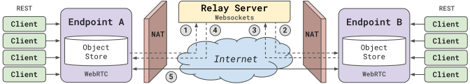
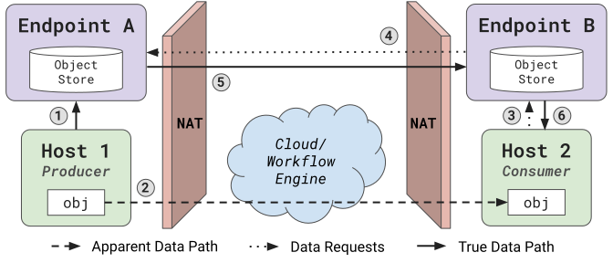

# Peer-to-Peer Endpoints

*Last updated 25 September 2026*

ProxyStore Endpoints are in-memory object stores
with peering capabilities. Endpoints enable data transfer with proxies
between multiple sites using NAT traversal.

!!! warning
    Endpoints are experimental and the interfaces and underlying
    implementations may change. Refer to the API docs for the most
    up-to-date information.

!!! warning "Use the same ProxyStore and Python versions everywhere"
    Clients and endpoints should use the same versions of ProxyStore and
    Python. Mismatched versions can cause errors when objects are serialized
    in one environment and deserialized in another. See
    [Version Compatibility](#version-compatibility) for details.

## Overview

At its core, the [`Endpoint`][proxystore.endpoint.endpoint.Endpoint] is
an in-memory data store built on asyncio. Endpoints serve clients on the local
network over an authenticated TCP protocol (see [Security](#security)), and
ProxyStore provides the
[`EndpointConnector`][proxystore.connectors.endpoint.EndpointConnector] as
the primary interface for clients to interact with endpoints.

{ width="100%" }
> <b>Figure 1:</b> ProxyStore Endpoints overview. Clients can make requests to
> any endpoint and those request will be forwarded to the correct endpoint.
> Endpoints establish peer-to-peer connections using UDP hole-punching and a
> publicly accessible relay server.

Unlike popular in-memory data stores (Redis, Memcached, etc.), ProxyStore
endpoints can operate as peers even from behind different NATs without the need
to open ports or SSH tunnels. To achieve direct data transfer between peers,
endpoints use the [WebRTC](https://webrtc.org/) standard to determine
how the peers can connect.

As shown in **Fig. 1**, endpoints use a commonly accessible *relay server*
to facilitate peer connections. When an endpoint is started, the Endpoint
registers with the relay server. Then, when an endpoint needs to make a
request from a peer, (1) the endpoint creates an *offer* and asks the
relay server to forward the offer to the peer endpoint. The relay
server forwards the offer (2) and the peer endpoint creates an *answer* to the
received offer. The peer endpoint returns the *answer* to the original
endpoint via the relay server (3, 4).

The offer and answer contain information about the local and remote sessions
of the endpoints which can be used to complete the peer-to-peer connection (5).
(*Note*: this is a great simplification and more details can be found at
https://webrtc.org/getting-started/peer-connections.) The peers will then
keep a data channel open between themselves for the remainder of their
lifetime.

Clients interacting with an endpoint via typical object store operations (*get*, *set*, etc.) specify a *key* and an *endpoint UUID*.
Endpoints that receive a request with a different endpoint UUID will attempt
a peer connection to the endpoint if one does not exist already and forward
the request along and facilitate returning the response back to the client.

## Endpoint CLI

!!! warning

    Peer-to-peer connections between two Endpoints are not supported on
    all network types. The NAT traversal techniques used to establish
    peer-to-peer connections are unreliable across symmetric NATs or poorly
    behaved legacy NATs. To check the compatibility of your network, use the
    [`proxystore-endpoint check-nat`](../api/cli.md#proxystore-endpoint-check-nat)
    CLI tool.

Endpoints can be configure and started with the
[`proxystore-endpoint`](../api/cli.md#proxystore-endpoint)
command. By default, an Endpoint is configured to connect to ProxyStore's
cloud-hosted relay server. This relay server uses
[Globus Auth](https://www.globus.org/globus-auth-service) for identity and
access management. To use the provided relay server, authenticate using the
[`proxystore-globus-auth login`](../api/cli.md#proxystore-globus-auth-login)
CLI. Authentication only needs to be performed once per system.

!!! tip

    Endpoints can be started using a client identity, rather than as a user,
    by exporting the `PROXYSTORE_GLOBUS_CLIENT_ID` and
    `PROXYSTORE_GLOBUS_CLIENT_SECRET` environment variables. This is similar
    to how
    [Globus Compute supports client login](https://funcx.readthedocs.io/en/latest/sdk.html#client-credentials-with-clients){target=_blank}.

```bash
$ proxystore-globus-auth login
$ proxystore-endpoint configure my-endpoint
INFO: Configured endpoint: my-endpoint <a6c7f036-3e29-4a7a-bf90-5a5f21056e39>
INFO: Config and log file directory: ~/.local/share/proxystore/my-endpoint
INFO: Start the endpoint with:
INFO:   $ proxystore-endpoint start my-endpoint
```

Endpoint configurations are stored in `$PROXYSTORE_HOME/{endpoint-name}`
or `$XDG_DATA_HOME/proxystore/{endpoint-name}`
(see [`home_dir()`][proxystore.utils.environment.home_dir]) and contain the
name, UUID, host address, port, relay server address, and more.

!!! tip

    By default, `$XDG_DATA_HOME/proxystore` will usually resolve to
    `~/.local/share/proxystore`. You can change this behavior by setting
    `$PROXYSTORE_HOME` in your `~/.bashrc` or similar configuration file.
    ```bash
    export PROXYSTORE_HOME="$HOME/.proxystore"
    ```

A typical configuration looks like the following.

```toml title="config.toml" linenums="1"
name = "my-endpoint"  # (1)!
uuid = "d27cf8cb-45fa-46b0-b907-27c830da62e3"  # (2)!
port = 8765  # (3)!
host_type = "ip"  # (4)!
tls = false  # (5)!

[relay]
address = "wss://relay.proxystore.dev"  # (6)!
peer_channels = 1  # (7)!
verify_certificate = true  # (8)!

[relay.auth]
method = "globus"  # (9)!

[relay.auth.kwargs]  # (10)!

[storage]
database_path = "~/.local/share/proxystore/my-endpoint/blobs.db"  # (11)!
max_object_size = 10000000  # (12)!
```

1. Human-readable name of this endpoint. Only used for logging and CLI
   operations.
2. Unique identifier of this endpoint.
3. Change the default port if running multiple endpoints on the same system.
4. When the `host_type` is "ip" or "fqdn", the host of the endpoint will be
   determined at runtime and set as the IP address or fully-qualified domain
   name, respectively. If `host_type` is "static", a static address can
   be specified in a `host` field (e.g., `host = "localhost"`).
5. Encrypt connections between clients and the endpoint with TLS. See
   [Security](#security) for details.
6. Comment out the relay address if you want to start the endpoint in SOLO
   mode. Peering will not be available, but all other functionality will
   remain.
7. Number of channels to multiplex peer communications over. Increasing this
   to two or four may improve performance on certain networks.
8. Only disable this when connecting to a local relay server using self-signed
   certificates for testing and development purposes.
9. Authentication method to use with the relay server. Comment this out when
   using a local relay server without authentication.
10. Optional keyword arguments to use when creating the authorization headers.
    Typically only used for testing and development purposes.
11. Optional path to a SQLite database for persisting endpoint objects. See
    the tip below for more details.
12. Maximum object size. Comment out to disable object size limits.

!!! tip

    Endpoints provide no data persistence by default, but this can be enabled
    by passing the `--persist` flag when configuring the endpoint or by
    setting `"database_path"` in the `[storage]` section of the config. When
    set, blobs stored by the endpoint will be written to a SQLite database
    file. Note this will result in slower performance.

An up-to-date configuration description can found in the
[`EndpointConfig`][proxystore.endpoint.config.EndpointConfig] docstring.

Starting the endpoint will load the configuration from the ProxyStore home
directory, initialize the endpoint, and start serving clients on the host and
port.

```bash
$ proxystore-endpoint start my-endpoint
```

!!! note

    By default, the `host` address that an endpoint is served on is set to
    the IP address of the node where the endpoint is started (so that an
    endpoint can be configured and started on different nodes).
    If clients cannot reach the endpoint at that IP address,
    changing the `host_type` in the configuration from "ip" to "fqdn" will
    use the fully-qualified domain name instead. Alternatively,
    `host_type = "static"` will use a static host address specified in the
    `host` field (i.e. `host = "12.34.56.78"`). The `--host` flag can also
    be used during configuration to specify "ip" (default), "fqdn", or a
    static host.

## Security

Clients connect to their local endpoint over TCP. Each time an endpoint
starts, it writes its address and a random token to the `connection.json`
file in the endpoint directory, and only the owner can read that file. When a client connects,
the client and endpoint each prove that they know the token without sending
it over the network. This means:

* Only processes that can read your endpoint directory can use your
  endpoint. Other users on a shared system cannot read, write, or evict
  your objects.
* A different server listening on the endpoint's address cannot impersonate
  your endpoint, so clients never send objects to it.

Clients on other nodes find the endpoint's address and token in the
ProxyStore home directory, so the home directory must be on a shared file
system that is private to your user.

Clients also trust every file in the endpoint directory, and the directory
contains the endpoint's database and log, so new endpoint directories are only
accessible by the owner, and the endpoint removes all group and other
permissions from its directory when it starts.

!!! tip

    If all clients run on the same node as the endpoint, set
    `host_type = "static"` and `host = "127.0.0.1"` in the endpoint
    configuration so the endpoint is not reachable from other nodes.

By default, objects are sent between clients and the endpoint unencrypted.
This is usually acceptable within a cluster because reading network traffic
typically requires root access. To encrypt connections, configure the
endpoint with TLS.

```bash
$ proxystore-endpoint configure my-endpoint --tls
```

Or, set `tls = true` in the endpoint's `config.toml` and restart the endpoint.
The endpoint generates a new self-signed certificate each time it starts and
writes its fingerprint to `connection.json`, and clients only trust that
certificate. TLS reduces the throughput of
large transfers by about half.

Connections between peer endpoints are separate. They are encrypted by WebRTC
and established through the relay server.

## EndpointConnector

The primary interface to endpoints is the
[`EndpointConnector`][proxystore.connectors.endpoint.EndpointConnector].

!!! note
    This section assumes familiarity with proxies and the
    [`Store`][proxystore.store.base.Store] interface. See the
    [Get Started](../get-started.md) guide before getting started with endpoints.

```python title="Endpoint Client Example" linenums="1"
from proxystore.connectors.endpoint import EndpointConnector
from proxystore.store import Store

connector = EndpointConnector(
    endpoints=[
        '5349ffce-edeb-4a8b-94a6-ab16ade1c1a1',
        'd62910f6-0d29-452e-80b7-e0cd601949db',
        ...,
    ],
)
store = Store(name='default', connector=connector)

p = store.proxy(my_object)
```

The [`EndpointConnector`][proxystore.connectors.endpoint.EndpointConnector] takes
a list of endpoint UUIDs. This list represents any endpoint that proxies
created by this store may interact with to resolve themselves. The
[`EndpointConnector`][proxystore.connectors.endpoint.EndpointConnector] will use this
list to find its *home* endpoint, the endpoint that will be used to issue
operations to. To find the *home* endpoint, the ProxyStore home directory
will be scanned for any endpoint configurations matching
the one of the UUIDs. If a match is found, the
[`EndpointConnector`][proxystore.connectors.endpoint.EndpointConnector] will attempt
to connect to the endpoint using the host and port in the configuration. This
process is repeated until a reachable endpoint is found. While the user could
specify the home endpoint directly, the home endpoint may change when a proxy
travels to a different machine.

## Version Compatibility

Objects are serialized by one client and deserialized by another, possibly
on a different system after being transferred between peer endpoints.
Pickle and cloudpickle do not guarantee that data pickled by one Python
version can be unpickled by another (in particular, functions and classes
pickled by value with cloudpickle), and ProxyStore's internal formats can
change between versions.

!!! warning

    Use the same ProxyStore version and the same Python major and minor
    version (e.g., 3.12) for all clients and endpoints. After upgrading
    ProxyStore, restart your endpoints.
    ```bash
    $ proxystore-endpoint stop my-endpoint
    $ proxystore-endpoint start my-endpoint
    ```

Clients and endpoints exchange their versions each time a client connects.

| Mismatch | Result |
| --- | --- |
| Client and endpoint protocol versions | Error. The connection is refused. |
| Client uses the older HTTP API | The client receives HTTP error 426 explaining that the client should be upgraded. |
| Endpoint uses the older HTTP API | Error explaining that the endpoint should be restarted with the client's version. |
| ProxyStore versions | The client warns with an [`EndpointVersionWarning`][proxystore.warnings.EndpointVersionWarning], and the endpoint logs a warning. |
| Python major or minor versions | Same as above. |
| Python patch versions (e.g., 3.12.1 vs. 3.12.4) | None. Patch releases are compatible. |

Versions are only checked between a client and its local endpoint. Versions
are **not** checked between peer endpoints or between the client that
created an object and the client that resolves it on another system, so keep
the environments on all systems consistent (e.g., with a lock file).

To turn the warning into an error, use a
[warnings filter](https://docs.python.org/3/library/warnings.html#the-warnings-filter).

```python
import warnings
from proxystore.warnings import EndpointVersionWarning

warnings.simplefilter('error', EndpointVersionWarning)
```

## Proxy Lifecycle

{ width="75%" style="display: block; margin: 0 auto" }
> <b>Figure 2:</b> Flow of data when transferring objects via proxies and endpoints.

In distributed systems, proxies created from an
[`EndpointConnector`][proxystore.connectors.endpoint.EndpointConnector] can be used
to facilitate simple and fast data communication.
The flow of data and their associated proxies are shown in **Fig. 2**.

1. Host A creates a proxy of the *target* object. The serialized *target*
   is placed in Host A's home/local endpoint (Endpoint 1).
   The proxy contains the key referencing the *target*, the endpoint UUID with
   the *target* data (Endpoint 1's UUID), and the list of
   all endpoint UUIDs configured with the
   [`EndpointConnector`][proxystore.connectors.endpoint.EndpointConnector]
   (the UUIDs of Endpoints 1 and 2).
2. Host A communicates the proxy object to Host B. This communication is
   cheap because the proxy is just a thin reference to the object.
3. Host B receives the proxy and attempts to use the proxy initiating the
   proxy *resolve* process. The proxy requests the data from Host B's
   home endpoint (Endpoint 2).
4. Endpoint 2 sees that the proxy is requesting data from a different endpoint
   (Endpoint 1) so Endpoint 2 initiates a peer connection to Endpoint 1 and
   requests the data.
5. Endpoint 1 sends the data to Endpoint 2.
6. Endpoint 2 replies to Host B's request for the data with the data received
   from Endpoint 2. Host B deserializes the target object and the proxy
   is resolved.

## Hosting a Relay Server

The [`proxystore-endpoint configure`](../api/cli.md#proxystore-endpoint-configure)
CLI will configure endpoints to use a relay server hosted by the ProxyStore
team.  If this is not suitable (or the ProxyStore relay is unavailable) we
provide all of the tools to host your own relay server. See the
[Relay Serving Guide](relay-serving.md) to learn more.
