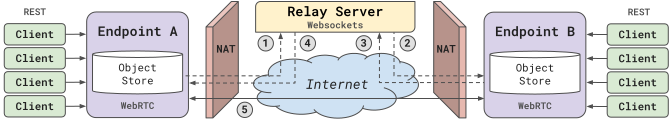
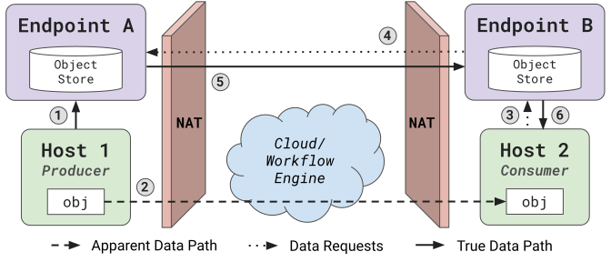

# Peer-to-Peer Endpoints

*Last updated 26 September 2026*

ProxyStore Endpoints are in-memory object stores
with peering capabilities. Endpoints enable data transfer with proxies
between multiple sites using NAT traversal.

!!! warning
    Endpoints are experimental and the interfaces and underlying
    implementations may change. Refer to the API docs for the most
    up-to-date information.

!!! warning "Use the same ProxyStore and Python versions everywhere"
    Clients and endpoints should use the same versions of ProxyStore and
    Python. Mismatched versions can cause errors when objects are serialized
    in one environment and deserialized in another. See
    [Version Compatibility](#version-compatibility) for details.

## Overview

At its core, the [`Endpoint`][proxystore.endpoint.endpoint.Endpoint] is
an in-memory data store built on asyncio. Endpoints serve clients on the local
network over an authenticated TCP protocol (see [Security](#security)), and
ProxyStore provides the
[`EndpointConnector`][proxystore.connectors.endpoint.EndpointConnector] as
the primary interface for clients to interact with endpoints.

{ width="100%" }
> <b>Figure 1:</b> ProxyStore Endpoints overview. Clients can make requests to
> any endpoint and those request will be forwarded to the correct endpoint.
> Endpoints establish peer-to-peer connections using UDP hole-punching.

Unlike popular in-memory data stores (Redis, Memcached, etc.), ProxyStore
endpoints can operate as peers even from behind different NATs without the
need to open ports or SSH tunnels. Endpoints connect to peers with
[iroh](https://www.iroh.computer/){target=_blank}, a peer-to-peer library
built on QUIC. Each endpoint is identified by its *endpoint ID*, the public
key of the endpoint's secret key, and iroh finds the addresses of a peer from
its ID, establishes a direct connection with UDP hole-punching when possible,
and relays traffic otherwise. An endpoint only communicates with the peers in
its allowlist (see [Peering](#peering)).

Clients interacting with an endpoint via typical object store operations (*get*, *set*, etc.) specify a *key* and an *endpoint ID*.
Endpoints that receive a request with a different endpoint ID will attempt
a peer connection to the endpoint if one does not exist already and forward
the request along and facilitate returning the response back to the client.

## Endpoint CLI

Endpoints can be configured and started with the
[`proxystore-endpoint`](../api/cli.md#proxystore-endpoint)
command.

```bash
$ proxystore-endpoint configure my-endpoint
Configured endpoint: my-endpoint <ed924cda74a1f625ea4e34bc7f3d4759f298b1a950dc41f87484d24023757173>
Config and log file directory: ~/.local/share/proxystore/my-endpoint
Start the endpoint with:
  $ proxystore-endpoint start my-endpoint
Allow a peer endpoint to communicate with this one with:
  $ proxystore-endpoint peers add my-endpoint PEER_NAME PEER_ID
```

Endpoint configurations are stored in `$PROXYSTORE_HOME/{endpoint-name}`
or `$XDG_DATA_HOME/proxystore/{endpoint-name}`
(see [`home_dir()`][proxystore.utils.environment.home_dir]) and contain the
name, ID, host address, port, and more. The endpoint's secret key
is stored separately in the `secret.key` file which only the owner can read.

!!! tip

    By default, `$XDG_DATA_HOME/proxystore` will usually resolve to
    `~/.local/share/proxystore`. You can change this behavior by setting
    `$PROXYSTORE_HOME` in your `~/.bashrc` or similar configuration file.
    ```bash
    export PROXYSTORE_HOME="$HOME/.proxystore"
    ```

A typical configuration looks like the following.

```toml title="config.toml" linenums="1"
version = 1  # (1)!
name = "my-endpoint"  # (2)!
id = "00a28e0d64fdb50d85d5cd1ff9d620cd6215a28c5c6c3e19637e09d2cbb54741"  # (3)!
port = 8765  # (4)!
host = "ip"  # (5)!
tls = false  # (6)!
max_object_size = "100 MB"  # (7)!

[p2p]
enabled = true  # (8)!
relays = "n0"  # (9)!
discovery = "n0"  # (10)!

[storage]
backend = "sqlite"  # (11)!
database_path = "blobs.db"  # (12)!
```

1. Format version of the configuration file. ProxyStore uses this to detect
   configurations written by an incompatible version.
2. Human-readable name of this endpoint. Must match the name of the
   endpoint directory.
3. Unique identifier of this endpoint. This is the public key of the
   endpoint's secret key and must match the key in `secret.key`.
4. Change the default port if running multiple endpoints on the same system.
5. Address clients use to connect to the endpoint. "ip" and "fqdn" use the
   IP address or fully-qualified domain name of the node, determined each
   time the endpoint starts. Any other value is used as a static address
   (e.g., `host = "127.0.0.1"`).
6. Encrypt connections between clients and the endpoint with TLS. See
   [Security](#security) for details.
7. Maximum size of an object that clients or peers can set, in bytes
   (e.g., `100000000`) or as a string with units (e.g., `"100 MB"` or
   `"1 GiB"`). Defaults to 100 MB if omitted. Set to `0` to disable object
   size limits.
8. Enable communication with peer endpoints. If `false`, the endpoint
   operates in isolation. Configure with `--no-peering` to disable peering.
9. Relays used to connect to peers. See [Relays](#relays).
10. Discovery service used to find the addresses of peers. See
    [Relays](#relays).
11. Storage backend. `"memory"` (the default) stores objects in memory, and
    `"sqlite"` persists objects to a SQLite database. See the tip below for
    more details.
12. Optional path to the SQLite database, which defaults to `blobs.db`. A
    relative path is relative to the endpoint directory. Use an absolute
    path to store a large database elsewhere, such as a parallel file
    system. Only valid with the `"sqlite"` backend.

!!! tip

    Endpoints provide no data persistence by default, but this can be enabled
    by passing the `--persist` flag when configuring the endpoint or by
    setting `backend = "sqlite"` in the `[storage]` section of the config.
    Blobs stored by the endpoint will then be written to a SQLite database
    file. Note this will result in slower performance.

An up-to-date configuration description can be found in the
[`EndpointConfig`][proxystore.endpoint.config.EndpointConfig] docstring.

Starting the endpoint will load the configuration from the ProxyStore home
directory, initialize the endpoint, and start serving clients on the host and
port.

```bash
$ proxystore-endpoint start my-endpoint
```

!!! note

    By default (`host = "ip"`), the endpoint is served on the IP address of
    the node where the endpoint is started, so an endpoint can be configured
    and started on different nodes. If clients cannot reach the endpoint at
    that IP address, `host = "fqdn"` uses the fully-qualified domain name
    instead, or set a static address (e.g., `host = "12.34.56.78"`). The
    `--host` flag can also be used during configuration. The endpoint never
    modifies its configuration; the resolved address is written to the
    `connection.json` file which clients read.

## Peering

### Adding Peers

Two endpoints can only communicate if each endpoint has the other in its
allowlist of peers, the `peers.toml` file in the endpoint directory.
Allowlisting the same peer on both sides is required, and the endpoint
refuses connections from, and requests to, any other endpoint. Peer
connections are encrypted and authenticated with TLS 1.3, so an endpoint
cannot pretend to be another endpoint without its secret key.

To connect endpoints on two systems, get the ID of each endpoint:

```bash
$ proxystore-endpoint id my-endpoint  # On system A
ed924cda74a1f625ea4e34bc7f3d4759f298b1a950dc41f87484d24023757173
$ proxystore-endpoint id cluster-endpoint  # On system B
00a28e0d64fdb50d85d5cd1ff9d620cd6215a28c5c6c3e19637e09d2cbb54741
```

Then add each endpoint to the peers of the other:

```bash
# On system A
$ proxystore-endpoint peers add my-endpoint cluster 00a28e0d64fdb50d85d5cd1ff9d620cd6215a28c5c6c3e19637e09d2cbb54741
# On system B
$ proxystore-endpoint peers add cluster-endpoint laptop ed924cda74a1f625ea4e34bc7f3d4759f298b1a950dc41f87484d24023757173
```

The names given to peers (e.g., `cluster` and `laptop`) are only used in logs
and by the CLI. List peers with
[`proxystore-endpoint peers list`](../api/cli.md#proxystore-endpoint-peers-list)
and remove a peer with
[`proxystore-endpoint peers remove`](../api/cli.md#proxystore-endpoint-peers-remove).
Changes to the peers take effect within about a second, even while the
endpoint is running. Removing a peer closes its connections and denies its
requests.

Endpoints owned by other users are added in the same way, so share your
endpoint's ID with a collaborator and add theirs to share data with them.

### Relays

Relays help peers establish direct connections and relay traffic between
peers when a direct connection is not possible (e.g., because a firewall
blocks UDP traffic). Relays only see encrypted traffic. Relayed transfers are
slower than direct transfers. Check if the connection to a peer is direct or
relayed with the
[`proxystore-endpoint client ... ping`](endpoints-debugging.md#ping-a-peer)
command. The relays are configured with the `relays`
option in the `[p2p]` section of the configuration or the `--relays` flag
when configuring an endpoint.

* `"n0"` (default): Use the public relays operated by
  [n0](https://n0.computer){target=_blank}, the developers of iroh.
* `"none"`: Disable relays. Peers can only connect directly.
* A list of URLs (e.g., `["https://relay.example.com"]`): Use self-hosted
  [`iroh-relay`](https://docs.iroh.computer/concepts/relays){target=_blank}
  servers. Sites that need reliability can run their own relay.

By default, endpoints also publish their addresses to, and look up the
addresses of peers from, n0's public DNS discovery service. Set
`discovery = "none"` in the `[p2p]` section of the configuration, or use the
`--discovery none` flag when configuring an endpoint, to disable discovery.
With `relays = "none"` and `discovery = "none"`, an endpoint does not
contact any third-party service, and it can only reach peers at their cached
addresses or peers that connected to it first.

ProxyStore does not operate any services, and n0's relays and discovery
service are provided on an as-available basis. If they are unavailable:

* Peers that can be reached directly (e.g., on the same network or with
  public IP addresses) and existing connections still work.
* Peers can be reached using their last known addresses. After each
  connection, an endpoint caches the addresses of the peer in the
  `peer-addrs.json` file in the endpoint directory, so peers can still be
  reached as long as their addresses have not changed.
* New connections between two peers that are both behind NATs fail unless
  the endpoints are configured with self-hosted relays.

### Platform Support

Endpoints and their clients (e.g., the
[`EndpointConnector`][proxystore.connectors.endpoint.EndpointConnector])
require the `endpoints` extra (`pip install proxystore[endpoints]`). Clients
and endpoints share the ProxyStore home directory, so use the same Python
environment for both. Peering uses the
[`iroh`](https://pypi.org/project/iroh/){target=_blank} package which only
provides wheels for Linux (x86_64 and aarch64, glibc 2.28 or newer), macOS
(arm64), and Windows (x86_64).

### Upgrading from ProxyStore v1

ProxyStore v1 endpoints used WebRTC and a relay server hosted by the
ProxyStore team to connect peers. The relay server has been removed, and
endpoints are now identified by an endpoint ID rather than a UUID, so
endpoints configured with ProxyStore v1 must be configured again.

```bash
$ proxystore-endpoint stop my-endpoint
$ proxystore-endpoint remove my-endpoint
$ proxystore-endpoint configure my-endpoint
```

Then, add the peers of the endpoint (see [Adding Peers](#adding-peers)) and
update the endpoint UUIDs passed to the
[`EndpointConnector`][proxystore.connectors.endpoint.EndpointConnector] to
the new endpoint IDs.

## Security

Clients connect to their local endpoint over TCP. Each time an endpoint
starts, it writes its address and a random token to the `connection.json`
file in the endpoint directory, and only the owner can read that file. When a client connects,
the client and endpoint each prove that they know the token without sending
it over the network. This means:

* Only processes that can read your endpoint directory can use your
  endpoint. Other users on a shared system cannot read, write, or evict
  your objects.
* A different server listening on the endpoint's address cannot impersonate
  your endpoint, so clients never send objects to it.

Clients on other nodes find the endpoint's address and token in the
ProxyStore home directory, so the home directory must be on a shared file
system that is private to your user.

Clients also trust every file in the endpoint directory, and the directory
contains the endpoint's secret key, database, and log, so new endpoint
directories are only accessible by the owner, and the endpoint removes all
group and other permissions from its directory and secret key when it
starts.

!!! tip

    If all clients run on the same node as the endpoint, set
    `host = "127.0.0.1"` in the endpoint configuration so the endpoint is
    not reachable from other nodes.

By default, objects are sent between clients and the endpoint unencrypted.
The token only authenticates each side when a connection is established;
the requests and responses that follow are not protected against tampering.
This is usually acceptable within a cluster because reading or modifying
network traffic typically requires root access. If clients connect to the
endpoint over a network you do not trust, configure the endpoint with TLS to
encrypt connections.

```bash
$ proxystore-endpoint configure my-endpoint --tls
```

Or, set `tls = true` in the endpoint's `config.toml` and restart the endpoint.
The endpoint generates a new self-signed certificate each time it starts and
writes its fingerprint to `connection.json`, and clients only trust that
certificate. TLS reduces the throughput of
large transfers by about half.

## EndpointConnector

The primary interface to endpoints is the
[`EndpointConnector`][proxystore.connectors.endpoint.EndpointConnector].

!!! note
    This section assumes familiarity with proxies and the
    [`Store`][proxystore.store.base.Store] interface. See the
    [Get Started](../get-started.md) guide before getting started with endpoints.

```python title="Endpoint Client Example" linenums="1"
from proxystore.connectors.endpoint import EndpointConnector
from proxystore.store import Store

connector = EndpointConnector(
    endpoints=[
        'ed924cda74a1f625ea4e34bc7f3d4759f298b1a950dc41f87484d24023757173',
        '10999b2967c8d649c1e9a2f91fb3ae45f8e51b1acfa91eccdb94c630e628c2e0',
        ...,
    ],
)
store = Store(name='default', connector=connector)

p = store.proxy(my_object)
```

The [`EndpointConnector`][proxystore.connectors.endpoint.EndpointConnector] takes
a list of endpoint IDs. This list represents any endpoint that proxies
created by this store may interact with to resolve themselves. The
[`EndpointConnector`][proxystore.connectors.endpoint.EndpointConnector] will use this
list to find its *home* endpoint, the endpoint that will be used to issue
operations to. To find the *home* endpoint, the ProxyStore home directory
will be scanned for any endpoint configurations matching
one of the IDs. If a match is found, the
[`EndpointConnector`][proxystore.connectors.endpoint.EndpointConnector] will attempt
to connect to the endpoint using the `connection.json` file that the running
endpoint writes to its directory (see [Security](#security)). This
process is repeated until a reachable endpoint is found. While the user could
specify the home endpoint directly, the home endpoint may change when a proxy
travels to a different machine.

## Version Compatibility

Objects are serialized by one client and deserialized by another, possibly
on a different system after being transferred between peer endpoints.
Pickle and cloudpickle do not guarantee that data pickled by one Python
version can be unpickled by another (in particular, functions and classes
pickled by value with cloudpickle), and ProxyStore's internal formats can
change between versions.

!!! warning

    Use the same ProxyStore version and the same Python major and minor
    version (e.g., 3.12) for all clients and endpoints. After upgrading
    ProxyStore, restart your endpoints.
    ```bash
    $ proxystore-endpoint stop my-endpoint
    $ proxystore-endpoint start my-endpoint
    ```

Clients and endpoints exchange their versions each time a client connects.

| Mismatch | Result |
| --- | --- |
| Client and endpoint protocol versions | The newest version both support is used. If there is none, the connection is refused. |
| Client uses the older HTTP API | The client receives HTTP error 426 explaining that the client should be upgraded. |
| Endpoint uses the older HTTP API | Error explaining that the endpoint should be restarted with the client's version. |
| ProxyStore versions | The client warns with an [`VersionMismatchWarning`][proxystore.warnings.VersionMismatchWarning], and the endpoint logs a warning. |
| Python major or minor versions | Same as above. |
| Python patch versions (e.g., 3.12.1 vs. 3.12.4) | None. Patch releases are compatible. |

Versions are only checked between a client and its local endpoint. Versions
are **not** checked between peer endpoints or between the client that
created an object and the client that resolves it on another system, so keep
the environments on all systems consistent (e.g., with a lock file).

To turn the warning into an error, use a
[warnings filter](https://docs.python.org/3/library/warnings.html#the-warnings-filter).

```python
import warnings
from proxystore.warnings import VersionMismatchWarning

warnings.simplefilter('error', VersionMismatchWarning)
```

### Protocols and File Formats

The protocols and files used by endpoints are versioned independently of
ProxyStore so incompatible changes are detected rather than causing
unexpected errors. Each version is only incremented on an incompatible
change.

| Interface | Version | Incompatible versions |
| --- | --- | --- |
| Client-endpoint protocol | [`MIN_PROTOCOL_VERSION`][proxystore.endpoint.protocol.MIN_PROTOCOL_VERSION] to [`PROTOCOL_VERSION`][proxystore.endpoint.protocol.PROTOCOL_VERSION] | The client and endpoint use the newest version both support. If there is none, the endpoint refuses the connection. |
| Peer protocol | The same versions as the client-endpoint protocol, negotiated as the ALPN of peer connections (see [`supported_alpns()`][proxystore.endpoint.protocol.supported_alpns]) | Peers use the newest version both support. If there is none, the connection fails. |
| `config.toml` | `version` field | The configuration cannot be read. |
| `peers.toml` | `version` field | No peers are allowed until the file is fixed. |
| `connection.json` | `version` field | Clients cannot connect. Restart the endpoint. |
| `peer-addrs.json` | `version` field | The cache is ignored. |

Endpoints are used through the `proxystore-endpoint` CLI and the
[`EndpointConnector`][proxystore.connectors.endpoint.EndpointConnector].
The Python interface of [`proxystore.endpoint`][proxystore.endpoint] is
documented but is an internal implementation detail which may change between
releases.

## Proxy Lifecycle

{ width="75%" style="display: block; margin: 0 auto" }
> <b>Figure 2:</b> Flow of data when transferring objects via proxies and endpoints.

In distributed systems, proxies created from an
[`EndpointConnector`][proxystore.connectors.endpoint.EndpointConnector] can be used
to facilitate simple and fast data communication.
The flow of data and their associated proxies are shown in **Fig. 2**.

1. Host A creates a proxy of the *target* object. The serialized *target*
   is placed in Host A's home/local endpoint (Endpoint 1).
   The proxy contains the key referencing the *target*, the endpoint ID with
   the *target* data (Endpoint 1's ID), and the list of
   all endpoint IDs configured with the
   [`EndpointConnector`][proxystore.connectors.endpoint.EndpointConnector]
   (the IDs of Endpoints 1 and 2).
2. Host A communicates the proxy object to Host B. This communication is
   cheap because the proxy is just a thin reference to the object.
3. Host B receives the proxy and attempts to use the proxy initiating the
   proxy *resolve* process. The proxy requests the data from Host B's
   home endpoint (Endpoint 2).
4. Endpoint 2 sees that the proxy is requesting data from a different endpoint
   (Endpoint 1) so Endpoint 2 initiates a peer connection to Endpoint 1 and
   requests the data.
5. Endpoint 1 sends the data to Endpoint 2.
6. Endpoint 2 replies to Host B's request for the data with the data received
   from Endpoint 1. Host B deserializes the target object and the proxy
   is resolved.
