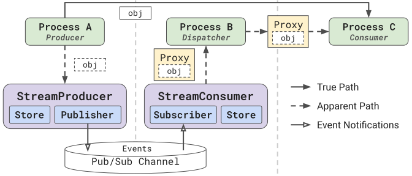

# Streaming Objects with ProxyStore

*Last updated 4 October 2026*

This guide describes the motivation for and usage of ProxyStore's
streaming interface.

!!! note

    Some familiarity with ProxyStore is assumed. Check out the
    [Get Started](../get-started.md){target=_blank} guide and
    [Concepts](../concepts/index.md){target=_blank} page to learn more about
    ProxyStore's core concepts.

The [`StreamProducer`][proxystore.stream.StreamProducer]
and [`StreamConsumer`][proxystore.stream.StreamConsumer] interfaces
decouple bulk object communication from event notifications through the use of
object proxies. This enables users to mix and match bulk object communication
methods (via the [`Connector`][proxystore.connectors.protocols.Connector]
interface) and message stream brokers (via the
[`Publisher`][proxystore.stream.protocols.Publisher] and
[`Subscriber`][proxystore.stream.protocols.Subscriber] interfaces).
Additionally, because the [`StreamConsumer`][proxystore.stream.StreamConsumer]
yields proxies of objects from the stream, bulk data transfer only occurs
between the source and *true* destination of the object from the stream
(i.e., the process which *resolves* the proxy from the stream).

## Use Cases

The ProxyStore streaming interface can be used anywhere where one process
needs to stream objects to another process, and the interface can be used
to optimize the deployment via different
[`Connector`][proxystore.connectors.protocols.Connector] and
[`Publisher`][proxystore.stream.protocols.Publisher]/
[`Subscriber`][proxystore.stream.protocols.Subscriber] implementations.

But, this model is particularly powerful for applications which dispatch
remote compute tasks on objects consumed from a stream.
To understand why, consider the
application in **Figure 1** where *Process A* is a data generator streaming
chunks of data (i.e., arbitrary Python objects) to *Process B*, a dispatcher
which dispatches a compute task on a remote *Process C* using the data
chunk.

{ width="100%" }
> <b>Figure 1:</b> ProxyStore Streaming example.

In this scenario, while the dispatcher is consuming from the stream,
the dispatcher does not need to have the actual chunk of data; rather,
it only needs to know that a chunk is ready in order to dispatch a task
which will actually consume the chunk. This is where a stream of proxies
is beneficial---the processes reading from the
[`StreamConsumer`][proxystore.stream.StreamConsumer] is receiving
lightweight proxies from the stream and passing those proxies along to later
computation stages. The bulk data are only transmitted between the data
generator and the process/node computing on the proxy of the chunk, bypassing
the intermediate dispatching process.

## Example

Here is an example of using the
[`StreamProducer`][proxystore.stream.StreamProducer]
and [`StreamConsumer`][proxystore.stream.StreamConsumer] interfaces
to stream objects using a file system and Redis server.
This configuration is optimized for storage of large objects using the
file system while maintaining low latency event notifications via Redis
pub/sub. However, the configuration can easily be optimized for different
applications or deployments by using a different
[`Connector`][proxystore.connectors.protocols.Connector] with the
[`Store`][proxystore.store.Store] for data storage and/or a different
[`Publisher`][proxystore.stream.protocols.Publisher] and
[`Subscriber`][proxystore.stream.protocols.Subscriber] implementation for
event notifications via a message broker.

```python title="producer.py" linenums="1"
from proxystore.connectors.file import FileConnector
from proxystore.store import Store
from proxystore.stream import StreamProducer
from proxystore.stream.shims.redis import RedisPublisher

store = Store(FileConnector(...))  # (1)!
publisher = RedisPublisher(...)  # (2)!
producer = StreamProducer(publisher, stores={'my-topic': store})  # (3)!

for item in ...:
    producer.send('my-topic', item, evict=True)  # (4)!

producer.close(topics=['my-topic'])  # (5)!
```

1. The [`Store`][proxystore.store.Store] configuration is determined by
   the producer. The
   [`StreamProducer`][proxystore.stream.StreamProducer] is
   initialized with a mapping of topics to stores such that different
   communication protocols can be used for different topics. Consider using
   different [`Connector`][proxystore.connectors.protocols.Connector]
   implementations depending on your deployment or data characteristics.
2. The [`Publisher`][proxystore.stream.protocols.Publisher] is the interface
   to a pub/sub channel which will be used for sending event metadata to
   consumers. The
   [`StreamProducer`][proxystore.stream.StreamProducer] also supports
   aggregation, batching, and filtering.
3. Instruct the producer to use a specific store for this topic name.
   Alternatively, `default_store` can be passed to use a specific store for all topics.
4. The state of the `evict` flag will alter if proxies yielded by a
   consumer are one-time use or not.
5. Closing the [`StreamProducer`][proxystore.stream.StreamProducer]
   will close the [`Publisher`][proxystore.stream.protocols.Publisher] by
   default. Pass `stores=True` to also close the
   [`Store`][proxystore.store.Store] instances (and their
   [`Connector`][proxystore.connectors.protocols.Connector] instances).
   Closing a store created by the producer process, as here, also clears
   the objects in its connector if the connector clears by default
   (e.g., the [`FileConnector`][proxystore.connectors.file.FileConnector]),
   so only close the stores once consumers are done with the stream.
   Topics are not closed by default and must be explicitly closed using the
   `topics` parameter or
   [`close_topics()`][proxystore.stream.StreamProducer.close_topics].
   Closing a topic will send a special end-of-stream event to the stream causing
   any consumers waiting on the stream to stop.

```python title="consumer.py" linenums="1"
from proxystore.proxy import Proxy
from proxystore.stream import StreamConsumer
from proxystore.stream.shims.redis import RedisSubscriber

subscriber = RedisSubscriber(...)  # (1)!
consumer = StreamConsumer(subscriber)  # (2)!

for item in consumer:  # (3)!
    assert isinstance(item, Proxy)  # (4)!

consumer.close()  # (5)!
```

1. The [`Subscriber`][proxystore.stream.protocols.Subscriber] is the interface
   to the same pub/sub channel that the producer is publishing event metadata
   to. These events are consumed by the
   [`StreamConsumer`][proxystore.stream.StreamConsumer] and used to
   generate proxies of the objects in the stream.
2. The [`StreamConsumer`][proxystore.stream.StreamConsumer] does not
   need to be initialized with a [`Store`][proxystore.store.Store]. Stream
   events will contain the necessary metadata for the consumer to get the
   appropriate [`Store`][proxystore.store.Store] to use for resolving
   objects in the stream.
3. Iterating on a [`StreamConsumer`][proxystore.stream.StreamConsumer] will
   block until a new event is published to the stream and then yields a proxy
   of the object associated with the event. Iteration
   will stop once the topic is closed by the
   [`StreamProducer`][proxystore.stream.StreamProducer].
4. The yielded proxies point to objects in the
   [`Store`][proxystore.store.Store], and the state of the `evict` flag
   inside the proxy's factory is determined in
   [`StreamProducer.send()`][proxystore.stream.StreamProducer.send].
5. Closing the [`StreamConsumer`][proxystore.stream.StreamConsumer] will close
   the [`Subscriber`][proxystore.stream.protocols.Subscriber] by default.
   Pass `stores=True` to also close the [`Store`][proxystore.store.Store]
   instances (and their
   [`Connector`][proxystore.connectors.protocols.Connector] instances)
   that the consumer made to resolve objects from the stream.
   These stores are created by the consumer from the stream events, so they
   are not the [`owner`][proxystore.store.base.Store.owner] of the objects
   and closing them never clears the objects in the producer's store.
   Stores which already existed in the consumer's process, such as the
   producer's store when both run in the same process, are not closed.

!!! tip

    By default, iterating on a
    [`StreamConsumer`][proxystore.stream.StreamConsumer] yields
    a proxy of the next object in the stream. The
    [`iter_with_metadata()`][proxystore.stream.StreamConsumer.iter_with_metadata],
    [`iter_objects()`][proxystore.stream.StreamConsumer.iter_objects], and
    [`iter_objects_with_metadata()`][proxystore.stream.StreamConsumer.iter_objects_with_metadata]
    methods provide additional mechanisms for iterating over stream data.

!!! warning

    If a topic does not have an associated store and a default store is not provided, then objects will be sent directly to the
    [`Publisher`][proxystore.stream.protocols.Publisher] and
    [`Subscriber`][proxystore.stream.protocols.Subscriber].
    This can be more performant when objects are small (e.g., *O(kB)*).
    In this case, the [`StreamConsumer`][proxystore.stream.StreamConsumer] will yield objects directly rather than proxies of the objects.

## Filtering

The [`StreamProducer`][proxystore.stream.StreamProducer]
and [`StreamConsumer`][proxystore.stream.StreamConsumer] accept an optional
[`Filter`][proxystore.stream.protocols.Filter] via the `keep` parameter.
A filter is called with the metadata of each event and returns `True` to
keep the event, like the function passed to the builtin [`filter()`][filter].
A producer will not send events which are filtered out, and a consumer will
skip events which are filtered out (evicting the associated object if the
`evict` flag was set by the producer).

```python title="consumer.py" linenums="1"
from proxystore.stream import StreamConsumer
from proxystore.stream.filters import SamplingFilter

consumer = StreamConsumer(
    subscriber,
    keep=lambda metadata: metadata.get('priority') == 'high',  # (1)!
)
sampled = StreamConsumer(subscriber, keep=SamplingFilter(0.1))  # (2)!
```

1. Only yield objects sent with `#!python metadata={'priority': 'high'}`.
2. The [`SamplingFilter`][proxystore.stream.filters.SamplingFilter] keeps
   each event with probability `p`.

## Multi-Producer/Multi-Consumer

The [`StreamProducer`][proxystore.stream.StreamProducer]
and [`StreamConsumer`][proxystore.stream.StreamConsumer] can support
multi-producer and multi-consumer deployments, respectively.
However, it is *not* a requirement that the
[`Publisher`][proxystore.stream.protocols.Publisher] or
[`Subscriber`][proxystore.stream.protocols.Subscriber] protocols
implement multi-producer or multi-consumer support.
In other words, it is up to each
[`Publisher`][proxystore.stream.protocols.Publisher]/
[`Subscriber`][proxystore.stream.protocols.Subscriber] implementation
to decide on and document their support for these features, and users
should confirm that the specific implementations or configuration parameters
produce the behavior they want.

**Multi-producer.** If a [`Publisher`][proxystore.stream.protocols.Publisher]
supports multiple producers, typically no changes are required on
when initializing the corresponding
[`StreamProducer`][proxystore.stream.StreamProducer]. Each producer
process can simply initialize the
[`Publisher`][proxystore.stream.protocols.Publisher]
and [`StreamProducer`][proxystore.stream.StreamProducer] and begin
sending objects to the stream.

**Multi-consumer.** If a [`Subscriber`][proxystore.stream.protocols.Subscriber]
supports multiple consumers, attention should be given to the manner in which
the consumers behave. If all consumers receive the full stream (i.e., each
consumer receives each object in the stream), then the `evict` flag of
[`StreamProducer.send()`][proxystore.stream.StreamProducer.send]
should be set to `False`. This ensures that the first consumer to resolve a
proxy from the stream does not delete the object data for the other consumers,
but this also means that object cleanup must be handled manually by the
application. Otherwise, the store will fill up with the entire stream of
objects. On the other hand, if each object in the stream is only received by
one consumer, then it *may* be safe to set `evict=True`.
